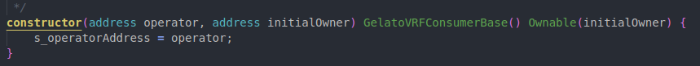
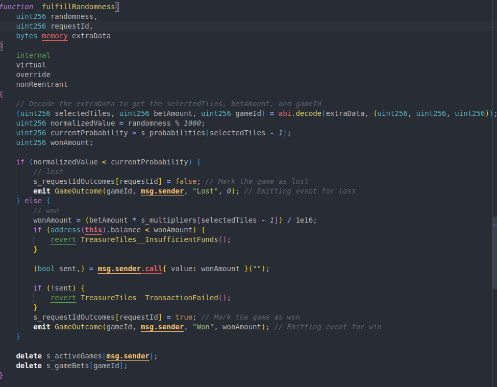

# Treasure Tiles

<p align="center">

<br/>


- [Treasure Tiles](#treasure-tiles)
- [About](#about)
    - [Key Benefits:](#key-benefits)
  - [Features](#features)
- [Challenge](#challenge)
- [Solution](#solution)
- [Why it Matters](#why-it-matters)
  - [Examples](#examples)
- [Getting Started](#getting-started)
  - [Requirements](#requirements)
  - [Installation](#installation)
  - [Development](#development)
    - [Smart Contract Development](#smart-contract-development)
    - [Frontend Development](#frontend-development)
    - [Backend Development](#backend-development)
  - [Testing](#testing)
    - [Smart Contract Tests](#smart-contract-tests)
    - [Frontend Tests](#frontend-tests)
    - [Integration Tests](#integration-tests)
  - [Deployment](#deployment)
    - [Deploying Smart Contracts to Mode Network](#deploying-smart-contracts-to-mode-network)
    - [Deploying Frontend](#deploying-frontend)
- [Audit Scope Details](#audit-scope-details)
  - [Roles](#roles)
  - [Known Issues](#known-issues)
- [Contract Logic](#contract-logic)
  - [Introduction](#introduction)
  - [Overview](#overview)
  - [Architecture](#architecture)
  - [Contract Structure](#contract-structure)
  - [Key Components](#key-components)
  - [State Variables](#state-variables)
  - [Functions](#functions)
    - [Constructor](#constructor)
    - [startGame](#startgame)
    - [_fulfillRandomness](#_fulfillrandomness)
    - [collectFees](#collectfees)
    - [getFees](#getfees)
    - [_operator](#_operator)
  - [Events](#events)
    - [GameStarted](#gamestarted)
    - [GameOutcome](#gameoutcome)
  - [Security Considerations](#security-considerations)


# About

- Treasure Tiles is an innovative blockchain-based casino game built on the Mode Network. Inspired by Stake.com's Mine game, Treasure Tiles offers a unique and engaging gaming experience where players use their intuition to uncover hidden treasures.

### Key Benefits:

- Transparent and provably fair gameplay
- Enhanced security for user data and funds
- Global accessibility without geographic restrictions
- Blockchain-based trust model

## Features

- Intuitive and engaging tile-based gameplay
- Real-time blockchain interactions
- Verifiable random number generation using Gelato VRF
- Transparent smart contract logic
- Seamless wallet integration for the Mode Network
- Responsive design for desktop and mobile play


# Challenge

- Treasure Tiles addresses key challenges in the online gambling industry by leveraging blockchain technology to enhance trust, transparency, and global accessibility. Built on the Mode Network, the game uses smart contracts and verifiable random number generation to ensure fair play and transparent outcomes.

# Solution

An ideal solution for the challenges faced by the online gambling industry would:
- Provide complete transparency in game mechanics and outcomes
- Ensure provable fairness through blockchain technology and smart contracts
- Offer robust security measures to protect user data and funds
- Enable global accessibility without geographic restrictions
- Maintain an engaging and intuitive user experience
- Allow for easy integration with various cryptocurrency wallets
- Provide real-time verification of game results
- Offer a scalable platform that can support multiple games
- Ensure compliance with relevant regulations while maintaining decentralization

Treasure Tiles aims to meet these criteria by leveraging the Mode Network's blockchain technology, implementing transparent smart contracts, using verifiable random number generation, and creating an engaging user interface that bridges the gap between traditional online casinos and blockchain technology.

<p align="center">

<br/>

# Why it Matters

Our solution impacts the target audience in several significant ways:
1. **Builds Trust**: By providing transparent and verifiable game mechanics, players can trust that the games are fair, potentially increasing player retention and attracting new users.
2. **Enhances Security**: Blockchain technology and smart contracts provide a secure environment for transactions and data storage, reducing the risk of fraud and hacks.
3. **Saves Money**: 
   - For players: Reduced risk of fraud means less potential for financial loss.
   - For operators: Lower overhead costs associated with traditional banking systems and reduced need for third-party audits.
4. **Saves Time**: Instant verification of results and quick, secure transactions streamline the gaming experience for players.
5. **Global Accessibility**: By removing geographic restrictions, we expand the potential player base, allowing more people to participate and potentially increasing revenue for the platform.
6. **Innovates the Industry**: Setting a new standard for transparency and fairness in online gambling can drive industry-wide improvements and innovations.

By addressing these key points, Treasure Tiles not only provides an engaging gaming experience but also solves critical issues in the online gambling industry, creating value for both players and operators.

## Examples

- Homechain https://github.com/0xBcamp/March-2023-Lima
- SmartVault https://github.com/0xBcamp/March-2023-Sierra
- Blockbadge https://github.com/0xBcamp/Sept23_Apprenticeship_Certification


# Getting Started

## Requirements

- [git](https://git-scm.com/book/en/v2/Getting-Started-Installing-Git)
  - You'll know you did it right if you can run `git --version` and you see a response like `git version x.x.x`
- [foundry](https://getfoundry.sh/)
  - You'll know you did it right if you can run `forge --version` and you see a response like `forge 0.2.0 (816e00b 2023-03-16T00:05:26.396218Z)`


## Installation
1. Clone the repository
   - git clone https://github.com/0xBcamp/jm-casino-games
   - cd treasure-tiles
3. Install dependencies: `npm install`
4. Set up environment variables:
- Copy `.env.example` to `.env`
- Fill in the required variables
4. Compile smart contracts: `forge build`
5. Run tests: `forge test`
6. Run the development server: `npm run dev`

## Development
### Smart Contract Development
1. Navigate to the `contracts/` directory
2. Modify or add Solidity contracts
3. Compile contracts: `forge build`
### Frontend Development
1. Navigate to the `frontend/` directory
2. Run the React development server: `npm start`
### Backend Development
1. Navigate to the `backend/` directory
2. Run the Node.js server: `npm run server`

## Testing
### Smart Contract Tests
Run the Foundry tests: `forge test`
### Frontend Tests
Run React component tests: `npm test`
### Integration Tests
Run end-to-end tests: `npm run test:e2e`

## Deployment
### Deploying Smart Contracts to Mode Network
1. Ensure the wallet is funded with MODE tokens
2. Update `foundry.toml` with the correct Mode Network RPC URL
3. Run the deployment script
### Deploying Frontend
1.	Build the frontend: `npm run build`
2. Deploy the built files to preferred hosting service (e.g., Vercel, Netlify)

# Audit Scope Details 

- Commit Hash: XXX
- Files in scope:
``` 
make scope
```
- Solc Version: X.X.X
- Chain(s) to deploy to:
  - XXX
- ERC20 Token Compatibilities:
  - XXX

## Roles
- Role1: Smart Contract Development
- Role2: Backend Development
- Role3: Frontend Development

## Known Issues

- Issue1: <!-- Description -->

##  Contract Logic

  ### Introduction
The treasure tiles contract is a casino game contract that allows users to bet and select boxes in hopes of finding treasures.

  ### Overview 
The TreasureTiles contract is a blockchain-based game where players place bets and select boxes in hopes of finding treasures. The game leverages Gelato's Verifiable Random Function (VRF) to ensure fair randomness in determining the outcomes of the game. The contract also incorporates security measures through OpenZeppelin's ReentrancyGuard and Ownable contracts.

### Architecture

 ### Contract Structure
The contract is structured as follows:

- Inheritance: Inherits from GelatoVRFConsumerBase for randomness, ReentrancyGuard for preventing reentrant calls, and Ownable for access control.

- State Variables: Manages game states, bet amounts, and outcomes.

- Functions: Includes game initialization, randomness fulfillment, and fee management functions.

- Events: Logs significant actions and outcomes within the game.

### Key Components
 
 ### State Variables

- s_activeGames: Tracks active game IDs for each player.
- s_gameBets: Stores bet amounts for each game ID.
- s_requestIdOutcomes: Maps request IDs to game outcomes.
- MAX_BOXES: Constant defining the maximum number of boxes a player can select.
- SERVICE_FEE: Constant representing the service fee percentage.
- s_operatorAddress: Address of the game operator.
- s_nextGameId: Incremental game ID.
- s_totalFees: Accumulated service fees.
- s_multipliers: Array of multipliers for different box selections.
- s_probabilities: Array of probabilities for different box selections.

  ### Functions

- constructor: Initializes the contract with operator and owner addresses.
- startGame: Initiates a new game session.
- _fulfillRandomness: Handles randomness fulfillment and determines game outcomes.
- collectFees: Allows the owner to withdraw accumulated service fees.
- getFees: Returns the total accumulated service fees.
- _operator: Internal function to get the operator's address.

  ### Events

- GameStarted: Emitted when a new game starts.
- GameOutcome: Emitted when a game concludes.

### Functions

- Constructor
Purpose: Initializes the contract with the operator and owner addresses.


- startGame
Purpose: Initiates a new game session for a player by accepting a bet and selected boxes.


- _fulfillRandomness
Purpose: Handles the randomness fulfillment from Gelato VRF and determines the game outcome.


- collectFees
Purpose: Transfers all accumulated service fees to the contract owner.


- getFees
Purpose: Returns the total amount of service fees accumulated in the contract.


- _operator
Purpose: Internal view function to return the operator's address.


### Event 

- GameStarted
Emitted when a new game session starts.


- GameOutcome
Emitted when a game session concludes.


### Security Considerations
- Reentrancy Protection
Uses ReentrancyGuard to prevent reentrant calls, ensuring state changes are protected against attacks.

- Access Control
Functions managing the game mechanics are restricted to the contract owner or operator using the Ownable contract.

- Fund Management
Ensures sufficient funds are available before attempting to payout winnings.
Accumulated service fees are only accessible by the contract owner, ensuring secure fund management.